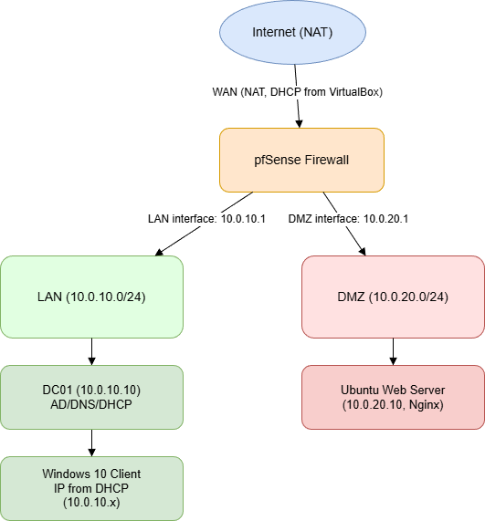

## Project Overview 
This project simulates a small enterprise environment using VirtualBox. 

It includes:
- **pfSense Firewall** (LAN + DMZ + WAN)
- **Windows Server 2022** (Active Directory + DNS + DHCP)
- **Windows 10 Client** (domain-joined workstation)
- **Ubuntu Web Server** (Nginx in a DMZ subnet)

The goal of this lab was to practice:
- Network segmentation
- Firewall configuration
- AD/DNS/DHCP management
- Troubleshooting (DNS, DHCP, routing, GPO)
- Packet capture and analysis
- Simulating real-world failures and recovery steps

--- 

## Network Topology 

### Subnets 
| **Network** | **Subnet** | **Purpose** |
|-------------|------------------|----------------------------------------| 
| **LAN** | 10.0.10.0/24 | Domain services + Windows clients | 
| **DMZ** | 10.0.20.0/24 | Web server (isolated zone) |
| **WAN** | NAT | Internet access |

### pfSense Interfaces
| Interface | IP | Purpose | 
|----------|----|---------| 
| **WAN** | DHCP (via NAT) | Internet |
| **LAN** | **10.0.10.1** | Internal network | 
| **DMZ** | **10.0.20.1** | Public/isolated subnet | 

---

### Diagram

 

---

## Setup Guide

### 1. VirtualBox Networking
- Create **Host-Only network #1** → LAN (10.0.10.0/24)
- Create **Host-Only network #2** → DMZ (10.0.20.0/24)
- Use **NAT** for WAN/Internet access

### 2. pfSense Configuration
- Assign WAN/LAN/DMZ
- Set **LAN = 10.0.10.1**
- Set **DMZ = 10.0.20.1**
- Create **firewall rules:**
  - Allow **LAN → any**
  - Allow **DMZ → WAN** (outbound only)
  - Allow **LAN → DMZ web (HTTP/HTTPS)**

### 3. Windows Server Setup
- Install **Active Directory Domain Services**
- Set static IP: **10.0.10.10**
- Create domain: **corp.local**
- Install **DNS + DHCP**
- Create DHCP scope: **10.0.10.50 - 10.0.10.200**

### 4. Windows 10 Client Setup
- Join domain: **corp.local**
- Test:
  - Domain login
  - DNS resolution
  - GPO mapping
  - Authentication to server resources

### 5. Ubuntu Web Server (DMZ)
- Set static IP: **10.0.20.10**
- Install **Nginx**
- Verify:
  - LAN client can reach 'http://web.corp.local'
  - DMZ cannot reach LAN (isolation works)

---

## Troubleshooting Scenarios

### **DNS Failure Simulation** 
**Broken:** Remove DNS forwarders → Internet names fail 

**Fix:** Re-add forwarders (1.1.1.1/8.8.8.8) 

### **DHCP Failure Simulation**
**Broken:** Disable DHCP scope → client gets APIPA

**Fix:** Re-enable scope and authorize DHCP

### **Group Policy Issue** 
**Broken:** Remove "Domain Users" from GPO security filtering → drive map (H:) fails

**Fix:** Add it back → 'gpupdate /force', verify with 'gpresult /r' 

### **Firewall Block Scenario** 
**Broken:** Block LAN → DMZ HTTP/HTTPS 

**Fix:** Re-add rule allowing LAN → DMZ web traffic 

### **Packet Capture (Wireshark)**
- Capture **ICMP** between LAN → DMZ
- Compare:
  - Allowed packets (normal traffic)
  - Blocked packets (pfSense denies)

--- 

## Screenshots 
(Add images here)

---

## Lessons Learned 
- How to configure and secure a multi-subnet enterprise network
- How AD, DNS, DHCP, and GPO work together
- Firewall rule logic (allow/deny across subnets)
- Practical troubleshooting using Wireshark and built-in tools
- How to simulate real-world outages and fix them

--- 

## Resume Bullet
**Built a full virtual environment using VirtualBox, pfSense, Windows Server 2022, and Linux/Windows clients, simulating a small company network and gaining experience with real networking and troubleshooting**
